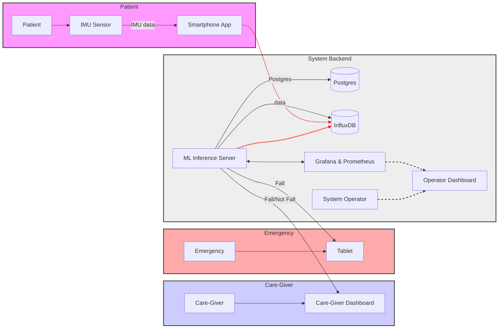

```mermaid

graph LR
    %% Subgraph 1: Patient
    subgraph Patient
        direction TB
        patient_icon[Patient] --> imu_sensor[IMU Sensor]
        imu_sensor -->|IMU data| smartphone_app[Smartphone App]
    end

    %% Subgraph 2: Care-Giver
    subgraph CareGiver [Care-Giver]
        direction TB
        care_giver_icon[Care-Giver] --> care_giver_dashboard[Care-Giver Dashboard]
    end

    %% Subgraph 3: Emergency
    subgraph Emergency
        direction TB
        emergency_icon[Emergency] --> emergency_tablet[Tablet]
    end

    %% Subgraph 4: System Backend
    subgraph SystemBackend [System Backend]
        direction TB
        ml_server[ML Inference Server] -->|Postgres| postgres_db[(Postgres)]
        ml_server -->|data| influx_db[(InfluxDB)]
        ml_server <--> grafana_prom[Grafana & Prometheus]
        grafana_prom --> operator_dashboard[Operator Dashboard]
        system_operator[System Operator] --> operator_dashboard
    end

    %% Connections between Subgraphs
    smartphone_app -.-> influx_db
    ml_server -.-> influx_db
    ml_server -->|Fall/Not Fall| care_giver_dashboard
    ml_server -->|Fall| emergency_tablet

    %% Styling
    style Patient fill:#f9f,stroke:#333,stroke-width:2px
    style CareGiver fill:#ccf,stroke:#333,stroke-width:2px
    style Emergency fill:#faa,stroke:#333,stroke-width:2px
    style SystemBackend fill:#eee,stroke:#333,stroke-width:2px
    
    %% Note: linkStyle indices start at 0 based on the order of arrows above
    linkStyle 7,8 stroke-width:2px,stroke-dasharray: 5 5
    linkStyle 9 stroke:#f00,stroke-width:2px
    linkStyle 10 stroke:#f00,stroke-width:3px

```