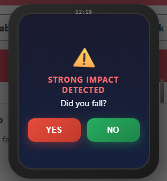

# Fall Detection System

A wrist-worn fall detection system using accelerometer and barometer sensor data from the SmarKo wearable device.

## System Architecture

```
┌─────────────────────────────────────────────────────────────────────────────┐
│                          Fall Detection System                              │
├─────────────────────────────────────────────────────────────────────────────┤
│                                                                             │
│   ┌───────────────┐      BLE       ┌───────────────┐                        │
│   │ SmarKo Watch  │ ─────────────> │  SmarKo App   │                        │
│   │  (Wearable)   │                │   (Mobile)    │                        │
│   │               │                │               │                        │
│   │ - Bosch ACC   │                │ - Data relay  │                        │
│   │ - BMP Baro    │                │ - BLE bridge  │                        │
│   └───────────────┘                └───────┬───────┘                        │
│                                            │                                │
│                                            │ HTTP POST                      │
│                                            ▼                                │
│   ┌───────────────────────────────────────────────────────────────────┐    │
│   │                    Laptop / Server                                │    │
│   │  ┌─────────────────────┐      ┌─────────────────────────────┐    │    │
│   │  │     InfluxDB        │<─────│     Flask App (this repo)   │    │    │
│   │  │   (Time-series DB)  │      │                             │    │    │
│   │  │                     │      │  - Real-time monitoring     │    │    │
│   │  │  - Stores sensor    │      │  - Fall detection ML model  │    │    │
│   │  │    data streams     │      │  - Web UI dashboard         │    │    │
│   │  │  - 30-day retention │      │  - CSV data export          │    │    │
│   │  └─────────────────────┘      └─────────────────────────────┘    │    │
│   │        (Optional: use Docker Compose for local setup)            │    │
│   └───────────────────────────────────────────────────────────────────┘    │
│                                                                             │
└─────────────────────────────────────────────────────────────────────────────┘
```

## Requirements

### Hardware
- **SmarKo Watch** - Wearable device with:
  - Bosch accelerometer (3-axis, ±6g range)
  - BMP barometer (24-bit resolution, pressure in Pa)
- **Smartphone** - Running the SmarKo App (Android/iOS)
- **Laptop/Server** - To run this Flask application

### Software
- **SmarKo App** - Mobile application that connects to the watch via BLE and relays sensor data
- **InfluxDB** (optional) - Time-series database for real-time data streaming
  - Can be self-hosted using the included Docker Compose configuration
  - Or use an existing InfluxDB Cloud instance
- **Python 3.8+** - For running this Flask application

## Quick Start Guide

### Step 1: Set Up the Environment

1. Clone this repository and create a virtual environment:
   ```bash
   git clone <repository-url>
   cd SmarKo_Fall_Detection
   python -m venv venv

   # Windows
   venv\Scripts\activate

   # Linux/Mac
   source venv/bin/activate
   ```

2. Install dependencies:
   ```bash
   pip install -r requirements.txt
   ```

3. Copy the environment template and configure:
   ```bash
   cp .env.example .env
   ```

4. Edit `.env` with your settings (see Configuration section below).

### Step 2: Set Up InfluxDB (Optional - for Real-time Mode)

**Option A: Use Docker (Recommended for local development)**
```bash
docker-compose up -d
```
This starts a local InfluxDB instance pre-configured for fall detection.

**Option B: Use existing InfluxDB instance**

Update `.env` with your InfluxDB connection details:
```bash
INFLUXDB_URL=https://your-influxdb-url:8086
INFLUXDB_TOKEN=your-token-here
INFLUXDB_ORG=your-org
INFLUXDB_BUCKET=your-bucket
```

### Step 3: Run the Application

```bash
python main.py
```

The application will start on `http://localhost:8000`. Open this URL in your browser to access the Web UI.

## Web User Interface

The Flask app provides a web-based dashboard for monitoring and data collection.



### Features

| Feature | Description |
|---------|-------------|
| **Start/Stop Recording** | Toggle data collection on/off. When recording is active, sensor data is saved to CSV files. |
| **Participant Name** | Free-text input field. The entered name is included in the exported CSV filename for easy identification (e.g., `fall_John_20260123_143022.csv`). |
| **Annotation Marker** | Insert manual truth markers into the data stream. Use this button when a fall event occurs during data collection to mark the exact timestamp. |
| **Real-time Status** | Displays current monitoring status, model version, and detection results. |

## Model Versions

This system supports two model versions:

| Version | Features | Barometer | Description |
|---------|----------|-----------|-------------|
| **V0** | 16 ACC | No | Accelerometer-only baseline model **(Default)** |
| **V3** | 16 ACC + 4 BARO | Yes | Combined accelerometer and barometer model |

### V0 - Accelerometer Only (Default)

The default model uses **16 statistical features** extracted from accelerometer data only. This model does not require barometer data, making it suitable for:
- Hardware without barometer sensors
- Testing with different accelerometer sampling rates (25Hz, 50Hz, 100Hz)
- Simpler deployment scenarios

**Accelerometer preprocessing** follows the statistical feature extraction approach from **Marques & Moreno (2023)**:

```
For each axis (X, Y, Z) and magnitude:
  - min: minimum value in window
  - max: maximum value in window
  - mean: average value in window
  - var: variance in window

Features (16 total):
  acc_x_min, acc_x_max, acc_x_mean, acc_x_var,
  acc_y_min, acc_y_max, acc_y_mean, acc_y_var,
  acc_z_min, acc_z_max, acc_z_mean, acc_z_var,
  acc_mag_min, acc_mag_max, acc_mag_mean, acc_mag_var
```

### V3 - Accelerometer + Barometer

The V3 model combines accelerometer features with barometer-based height change detection for improved accuracy.

- **Accelerometer preprocessing**: Statistical features from **Marques & Moreno (2023)** (same as V0)
- **Barometer preprocessing**: Slope-limit filtering from **Jatesiktat & Ang (2017)**

**Barometer features (4 total)**:
```
pressure_shift      - Total pressure change from filtered signal
middle_slope        - Slope at window midpoint
post_fall_slope     - Slope in second half of window
filtered_pressure_var - Variance of filtered signal
```

The barometer processing applies:
1. **Slope-limit filter**: Limits rate of change to 25 units/sample to remove sudden pressure spikes from environmental factors (doors, AC)
2. **Moving average**: 1-second smoothing window

## Configuration

### Default Settings

The default configuration uses V0 model with 50Hz accelerometer sampling:

```bash
# .env file
MODEL_VERSION=v0
HARDWARE_ACC_SAMPLE_RATE=50
DATA_SOURCE=influx
```

### Sampling Rate Configuration

The model expects **50Hz accelerometer data**. If your hardware uses a different sampling rate, the system automatically resamples:

| Hardware Rate | Resampling | Method |
|---------------|------------|--------|
| **25 Hz** | Upsampling to 50Hz | Linear interpolation (default) |
| **50 Hz** | None (native rate) | - |
| **100 Hz** | Downsampling to 50Hz | Decimation |

To change the hardware sampling rate, update `.env`:
```bash
HARDWARE_ACC_SAMPLE_RATE=25  # or 50, 100
RESAMPLING_METHOD=linear     # linear, cubic, nearest (for upsampling)
                             # decimate, average (for downsampling)
```

### Using V3 Model (with Barometer)

To use the V3 model with barometer data:
```bash
MODEL_VERSION=v3
BAROMETER_ENABLED=true
```

Note: V3 requires barometer data to be available from your hardware.

## Hardware Specifications

| Sensor | Sample Rate | Range/Resolution | Notes |
|--------|-------------|------------------|-------|
| **Accelerometer** | 50 Hz (default) | ±6g | 3-axis (X, Y, Z), supports 25/100 Hz with resampling |
| **Barometer** | 25 Hz | 24-bit | Pressure in Pa (required for V3 model only) |

## Data Sources

### Real-time Mode (InfluxDB)
```bash
DATA_SOURCE=influx
```
Connects to InfluxDB for live sensor data streaming from the SmarKo system.

### Batch Validation Mode (CSV)
```bash
DATA_SOURCE=csv
CSV_FILE_PATH=C:\path\to\your\data.csv
CSV_WINDOW_INTERVAL_SECONDS=1.0
```
Processes a CSV file with sliding windows for offline validation.

**Expected CSV format:**
- `timestamp`: epoch milliseconds
- `is_accelerometer_bosch`: 1 if row has ACC data
- `bosch_acc_x`, `bosch_acc_y`, `bosch_acc_z`: raw accelerometer values
- `is_pressure`: 1 if row has barometer data (for V3)
- `pressure_in_pa`: pressure value in Pascals (for V3)

## API Endpoints

| Endpoint | Method | Description |
|----------|--------|-------------|
| `/` | GET | Web UI dashboard |
| `/trigger` | POST | Run fall detection (uses configured data source) |
| `/validate-csv` | POST | Validate specific CSV file |
| `/model/info` | GET | Get current model information |
| `/recording/state` | POST | Update recording state and participant info |
| `/manual_truth/marker` | POST | Write manual truth annotation marker |
| `/events` | GET | SSE stream for real-time notifications |
| `/monitoring/status` | GET | Get monitoring status |
| `/monitoring/stop` | POST | Stop continuous monitoring |

## Directory Structure

```
FallDetection/
├── main.py                     # Flask application entry point
├── requirements.txt            # Python dependencies
├── .env.example                # Environment variable template
├── docker-compose.yml          # InfluxDB local setup
├── config/
│   └── settings.py             # Configuration loader (.env parsing)
├── app/
│   ├── core/                   # Business logic: inference engine, model config, session state
│   ├── services/               # Background workers: continuous monitoring thread
│   ├── middleware/             # Request interceptors: API key auth, rate limiting, CORS
│   ├── routes/                 # Flask blueprints (organizational container for event_handlers = route functions): /trigger, /recording, /monitoring endpoints
│   ├── data_input/             # Inbound I/O: InfluxDB fetching, preprocessing, resampling, calibration
│   ├── data_output/            # Outbound I/O: CSV export, InfluxDB marker writing
│   ├── utils/                  # Shared helpers: logging, shared state (queues, locks)
│   └── static/                 # Frontend: web dashboard (index.html)
├── model/
│   ├── model_v0/               # V0 trained model (ACC only)
│   └── model_v3/               # V3 trained model (ACC + BARO)
├── Docu/                       # Documentation and screenshots
└── results/
    ├── logs/                   # Application logs
    └── exported_flaskApp_data/ # Exported CSV detection data
```

## References

1. Marques, J., & Moreno, P. (2023). "Online Fall Detection Using Wrist Devices." *Sensors*, 23(3), 1146. https://doi.org/10.3390/s23031146

2. Jatesiktat, P., & Ang, W. T. (2017). "An Elderly Fall Detection Using a Wrist-worn Accelerometer and Barometer." *2017 IEEE International Conference on Robotics and Biomimetics (ROBIO)*, pp. 125-130. https://doi.org/10.1109/ROBIO.2017.8324399
