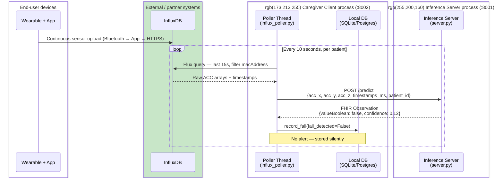
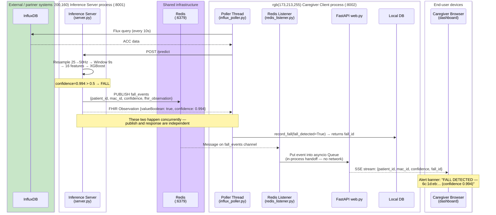
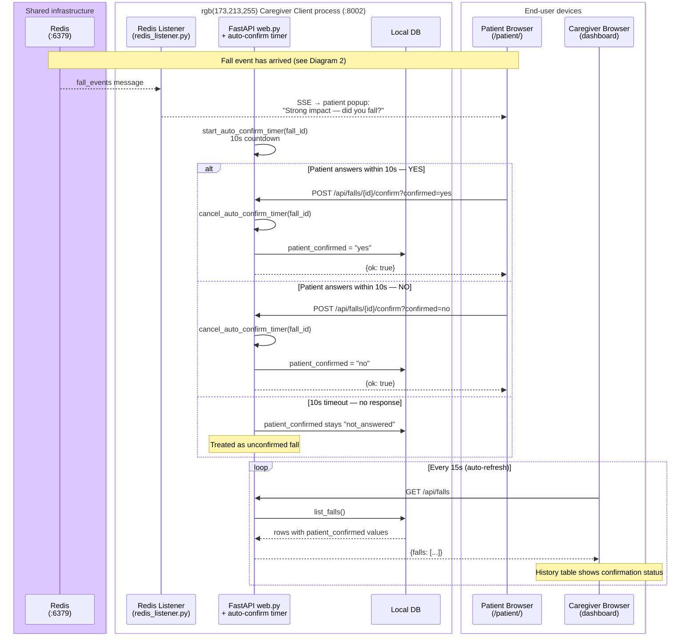
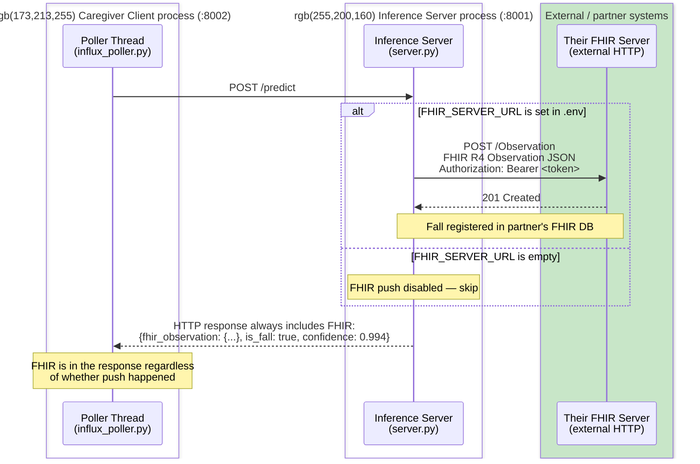
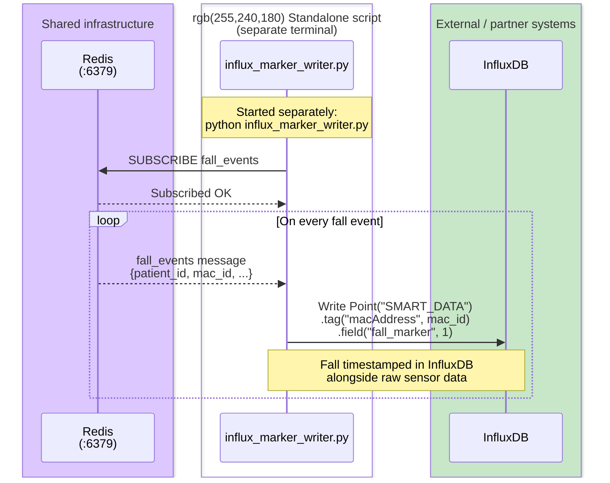
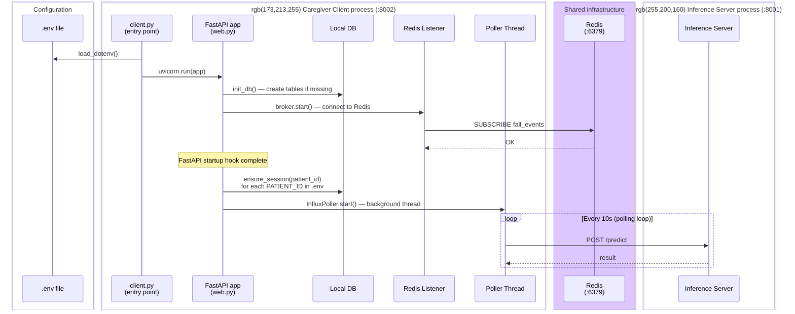

# UML Sequence Diagram — Fall Detection System (with hosting groups)
Render with: VS Code + "Markdown Preview Mermaid Support" extension (v1.26+), or paste into https://mermaid.live

## Color key

| Color | Hosting group |
|-------|--------------|
| 🔵 Blue | **Caregiver Client process** — single Python process on one machine (port 8002) |
| 🟠 Orange | **Inference Server process** — separate Python process (port 8001) |
| 🟣 Purple | **Shared infrastructure** — Docker containers (Redis) |
| 🟢 Green | **External / partner systems** — InfluxDB, FHIR server (not our machines) |
| ⬜ White | **End-user devices** — browsers, wearable |

---

## Diagram 1 — Normal Polling Cycle (no fall detected)



---

## Diagram 2 — Fall Detected → Real-Time Alert



---

## Diagram 3 — Patient Feedback Flow



---

## Diagram 4 — Optional FHIR Server Push



---

## Diagram 5 — InfluxDB Fall Marker Writer (standalone script)



---

## Diagram 6 — Startup Sequence



---

## Summary — What lives where

```
┌─────────────────────────────────────────────────────────┐
│  🟠 INFERENCE SERVER process  (port 8001)               │
│     inference_server/server.py                          │
│     Start: uvicorn inference_server.server:app          │
└─────────────────────────────────────────────────────────┘

┌─────────────────────────────────────────────────────────┐
│  🔵 CAREGIVER CLIENT process  (port 8002)               │
│     client.py           ← entry point                   │
│       ├── influx_poller.py   [background thread]        │
│       ├── redis_listener.py  [async task in FastAPI]    │
│       ├── web.py             [FastAPI event loop]       │
│       └── db.py              [SQLite file on disk]      │
│     Start: python -m fall_dashboard.client            │
└─────────────────────────────────────────────────────────┘

┌─────────────────────────────────────────────────────────┐
│  🟣 REDIS  (Docker container, port 6379)                │
│     Start: docker run -d -p 6379:6379 redis:7           │
│     Not our code — third-party service                  │
└─────────────────────────────────────────────────────────┘

┌─────────────────────────────────────────────────────────┐
│  🟡 INFLUX MARKER WRITER  (standalone script)           │
│     influx_marker_writer.py                             │
│     Start: python influx_marker_writer.py               │
│     Subscribes Redis → writes to InfluxDB               │
└─────────────────────────────────────────────────────────┘

┌─────────────────────────────────────────────────────────┐
│  🟢 EXTERNAL (not our machines)                         │
│     InfluxDB  — cloud-hosted by partner                 │
│     FHIR Server — partner's server (optional push)      │
└─────────────────────────────────────────────────────────┘

⬜ BROWSERS — end-user devices (caregiver PC, patient phone)
```
