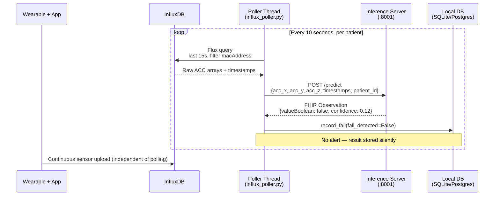
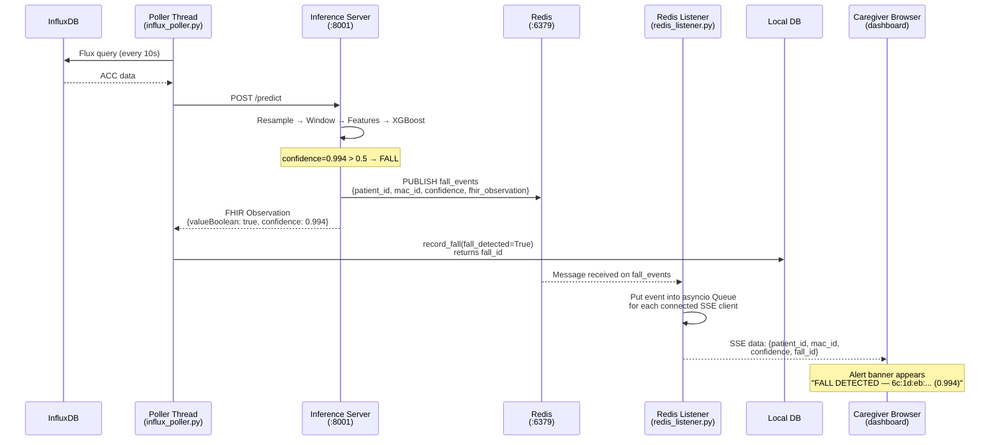
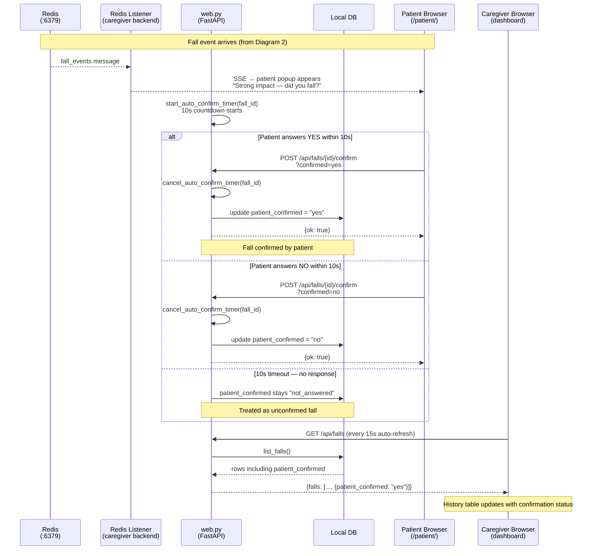
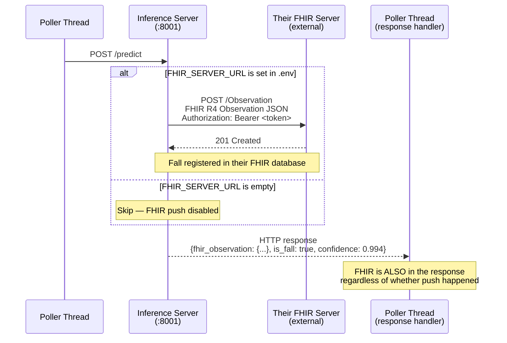
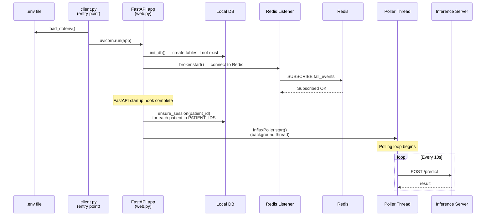

# UML Sequence Diagram — Fall Detection System
Render with: VS Code + "Markdown Preview Mermaid Support" extension, or paste into https://mermaid.live

---

## Diagram 1 — Normal Polling Cycle (no fall detected)



---

## Diagram 2 — Fall Detected → Real-Time Alert



---

## Diagram 3 — Patient Feedback Flow



---

## Diagram 4 — Optional FHIR Server Push



---

## Diagram 5 — Full System Startup Sequence



---

## Plain-text summary (actors and their communication protocols)

```
Actor                     Communicates with        Protocol
─────────────────────────────────────────────────────────────
Wearable App         →   InfluxDB                  HTTPS
Poller Thread        →   InfluxDB                  HTTP (Flux query)
Poller Thread        →   Inference Server          HTTP POST /predict
Inference Server     →   Redis                     Redis PUBLISH
Inference Server     →   Their FHIR Server         HTTP POST (optional)
Redis Listener       ←   Redis                     Redis SUBSCRIBE
Redis Listener       →   SSE Queue                 asyncio (in-process)
Web.py (FastAPI)     →   Browser (caregiver)       SSE + HTTP responses
Web.py (FastAPI)     →   Browser (patient)         SSE + HTTP responses
Browser (patient)    →   Web.py (FastAPI)          HTTP POST (feedback)
Browser (caregiver)  →   Web.py (FastAPI)          HTTP GET (polling)
influx_marker_writer ←   Redis                     Redis SUBSCRIBE
influx_marker_writer →   InfluxDB                  HTTP (write point)
```
