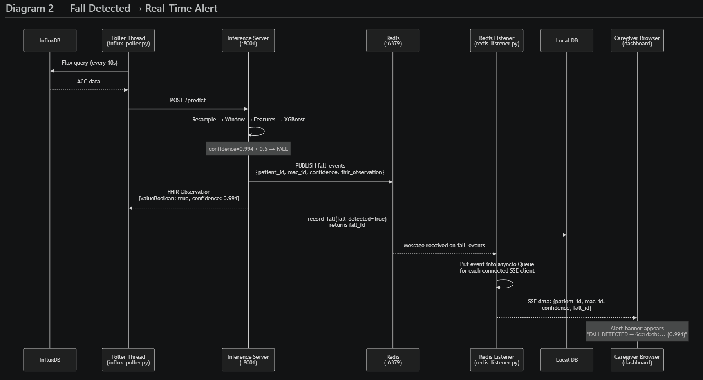

# Meeting Agenda — Fall Detection Integration
**With:** FOCUS (technical partner)  
**Also involving:** Charite (medical trial operator)  
**Prepared by:** Hayate Sato (Data Scientist)  
**Duration suggested:** 60–90 minutes

---

## Agenda Overview

| # | Topic | Time | Who leads |
|---|-------|------|-----------|
| 1 | Introductions + goal of meeting | 5 min | Both |
| 2 | What we deliver — system overview | 10 min | Us |
| 3 | Their existing stack — discovery | 20 min | Them |
| 4 | Integration boundary — where do the systems connect? | 15 min | Both |
| 5 | Data contract — exact inputs/outputs | 10 min | Both |
| 6 | Deployment — how and where does it run? | 10 min | Both |
| 7 | Open questions + next steps | 10 min | Both |

---

## 1. Introductions + Goal (5 min)

**Goal of this meeting:**
> Agree on *where* our fall detection system connects to FOCUS's existing infrastructure, and define the concrete next steps to build that connection.

**What success looks like after this meeting:**
- Both sides understand what the other provides
- Integration boundary is agreed (API call? shared DB? Docker container?)
- A checklist of information to exchange before development starts

---

## 2. What We Deliver — System Overview (10 min)

*Walk through the diagram below, then summarise the key points.*

### System Architecture Diagram



### Key points to cover

- We provide a **REST API** (`POST /predict`) that receives sensor data and returns a **FHIR R4 Observation**
- Fall detection runs on a **9-second sliding window** of accelerometer data — inference takes ~5ms, no GPU needed
- The **caregiver client** component polls their InfluxDB on a timer (every 10s), calls our API, stores fall history locally, and pushes real-time alerts — but this whole component is optional if they already have an equivalent
- The inference server can also **push FHIR Observations directly to their FHIR server** on every detected fall — configured by one `.env` variable
- Real-time alerts travel: inference server → Redis (internal pub/sub) → caregiver backend → SSE stream → browser. Redis is internal only; browsers never connect to Redis directly
- Everything is configurable via a single `.env` file; can run as a Docker container on their infrastructure
- **We do not store raw sensor data** — your InfluxDB remains the single source of truth

**Leave time for:** one or two clarifying questions before moving on.

---

## 3. Their Existing Stack — Discovery (20 min)

*This is the most important part of the meeting. Ask, listen, take notes.*

### 3a. Sensor + Data Storage

- [x] Confirmed: they are using the SmarKo wearable — same hardware as our training data
- [ ] What accelerometer sample rate setting is active on their SmarKo devices? (25Hz or 100Hz?)
  - *Why: the SmarKo app supports both. Our model expects 25Hz input — if they are running at 100Hz we need to downsample. This is a setting in the SmarKo app, not hardware-fixed.*
- [x] Barometer not required — we will use **model v0 (ACC only)**. No `bmp_pressure` needed.
- [ ] What does their InfluxDB structure look like?
  - Measurement name? (We assume `SMART_DATA`)
  - Which tag identifies each patient/device? (We use `macAddress` — a hardware tag the SmarKo app writes automatically)
  - What are the field names for ACC axes? (We use `bosch_acc_x`, `bosch_acc_y`, `bosch_acc_z`)
- [ ] Is their InfluxDB cloud-hosted or on-premise?
  - *Why: if it is on a different server than our containers, we need to confirm our containers can reach it over the network*

### 3b. Dashboard + Monitoring System

- [ ] What does their current monitoring dashboard show?
  - Just a patient list? Fall history table? Any alerting?
  - *This tells us how much of our caregiver client they need vs. already have*
- [ ] How is the dashboard built? (React / Vue / Angular / plain JS / something else?)
- [ ] Does the dashboard currently show any real-time updates, or is it static / manually refreshed?
  - *Confirmed: they do not currently have real-time fall alerts. The question is whether they want to add this capability and how.*
  - To add real-time alerts, their frontend would need to connect to our **SSE stream** (`GET /api/stream`). This is one line of JavaScript: `new EventSource('/api/stream')`. We need to know if their frontend team can add that.
  - **Alternative if they cannot change the frontend**: they could poll our REST API (`GET /api/falls`) every few seconds instead — no frontend change required, slightly less instant
  - *Note: Redis is internal infrastructure on our side only — their dashboard never connects to Redis directly. The question is only about how their browser receives the event from our backend (SSE or polling)*
- [ ] Do they have existing patient identifiers we should use?
  - *We use these as the FHIR `Patient/<id>` reference. If they already have IDs in their system we should match them, not invent new ones*

### 3c. Detection Result Destination — FHIR, Dashboard, or InfluxDB?

*Our current implementation outputs results in FHIR R4 format. But we do not actually know yet how they want to receive or store the detection result. This section clarifies that.*

- [ ] **Do they actually have a FHIR server?**
  - We assumed yes based on a colleague's comment, but this is unconfirmed. Ask directly.
  - If no FHIR server: we can return plain JSON instead — FHIR output is a wrapper we built, not a hard requirement
- [ ] **Where do they want the detection result to arrive?** (choose one or more)
  - **Option 1 — FHIR server**: our server POSTs the result directly to their FHIR server as an Observation resource. The result lives in their FHIR database. Their dashboard reads from FHIR.
  - **Option 2 — Their local dashboard DB**: we return the result in our API response, and their code stores it in whatever database their dashboard already reads from
  - **Option 3 — Back to InfluxDB**: we write a `fall_marker` field back to InfluxDB alongside the original sensor data. Their existing InfluxDB-based dashboard can then show it. *(We already built this — `influx_marker_writer.py` does exactly this)*
  - **Option 4 — SSE stream only (no DB)**: we push a live event to their dashboard via SSE on every fall, and they store it themselves
  - *Multiple options can be active simultaneously*
- [ ] If they have a FHIR server: which one? (HAPI FHIR, Azure Health Data Services, Firely, other?)
  - *Different FHIR servers have minor validation quirks — knowing which one lets us test compatibility*
- [ ] If FHIR push: what is the base URL and what authentication does it require? (Bearer token? No auth on internal network?)
- [ ] Are there specific FHIR coding systems or fields they require?
  - *We use: SNOMED CT 217082002 = Fall event, LOINC 72514-3 = confidence score. If their validator is strict we may need to adjust the codes*

### 3d. Infrastructure

- [ ] Confirmed: they host everything on their own machine/cloud. Where specifically?
  - Same server as InfluxDB, or different?
  - Cloud provider (AWS / Azure / GCP) or on-premise physical server?
- [ ] CPU architecture of the server? (x86_64 / AMD64 is standard; ARM if AWS Graviton or Apple Silicon)
  - *Why: Docker images must match the CPU architecture. x86 is fine for us; ARM needs a separate build*
- [ ] Do they already have Redis in their stack, or should we bring our own?
  - *Redis is used internally between our inference server and caregiver backend — it is a simple Docker container and we can provide it, but if they already have one we can reuse it*
- [ ] Do they already have Postgres, or do we use our default SQLite?
  - *For a small trial SQLite is fine. For production or multi-server setups, Postgres is better. One `.env` line switches between them*
- [ ] Network: can a Docker container on their server make outbound HTTP requests to their InfluxDB?
  - *This is usually yes on the same network, but firewalls or VPNs can block it — worth confirming before we start*
- [ ] Does their security policy require HTTPS for internal services, or is HTTP acceptable on their private network?
  - *SSL/TLS = the `https://` encryption that prevents data being read in transit. If our container and their services are on the same private server/network, HTTP is usually fine. If the connection crosses the internet or they have an "encrypt everything" policy, we need to add an nginx reverse proxy with an SSL certificate in front of our service. Worth asking their DevOps — it changes our setup slightly.*

---

## 4. Integration Boundary — Where Do the Systems Connect? (15 min)

*This is the key decision of the meeting. There are three options — agree on one.*

### Option A — Inference Server only (simplest)
```
Their system (they build/have an InfluxDB poller + dashboard)
    │
    └──► POST /predict  →  our inference server
                                │
                                └──► FHIR Observation in response
                                          │
                                          └──► They handle: FHIR push + dashboard update
```
**We provide:** one Docker container (inference server only), `.env.example`, API docs  
**They do:** call our `/predict` endpoint from their own code, push FHIR themselves  
**Requires:** they have or can build an InfluxDB poller  
**Best if:** FOCUS already has integration infrastructure and just needs the ML endpoint

### Option B — Full client + server (reference implementation)
```
Their InfluxDB
    │
    └──► Our caregiver client (polls InfluxDB → POST /predict → stores history)
              │
              ├──► FHIR auto-pushed to their FHIR server (optional, one .env line)
              ├──► SSE stream → their dashboard subscribes for live alerts
              └──► REST GET /api/falls → their dashboard queries for history
```
**We provide:** two Docker containers (inference server + caregiver client), Redis container  
**They do:** point their dashboard at our SSE endpoint and/or REST API  
**Requires:** they give us their InfluxDB credentials in our `.env`  
**Best if:** they want a working end-to-end solution with minimal development on their side

### Option C — Merged into their Docker Compose
```
Their existing docker-compose.yml
    + our services added as new containers on the same Docker network
```
**We provide:** service definitions to add to their compose file  
**They do:** merge and deploy  
**Requires:** they share their compose structure with us so we can wire the network correctly  
**Best if:** they already have a Docker Compose stack and want one unified deployment

**Question to ask:** *"Which of these fits best with how your system is currently structured?"*

---

## 5. Data Contract — Exact Inputs and Outputs (10 min)

*Make sure both sides agree on these specifics before leaving.*

### What our API needs as input (per prediction call):
```json
{
  "patient_id":    "Patient/charite-001",
  "device_id":     "6c:1d:eb:04:a9:e6",
  "acc_x":         [1024, 1028, ...],
  "acc_y":         [512,  510,  ...],
  "acc_z":         [4096, 4100, ...],
  "timestamps_ms": [1700000000000, 1700000040, ...],
  // no barometer — model v0 is ACC only
}
```
- ACC values are **raw LSB integers** as stored in InfluxDB by the SmarKo app — we convert to g internally
- At least 15 seconds of data (15s × 25Hz = 375 samples per axis) is needed for one prediction

### What we return:
```json
{
  "patient_id": "Patient/charite-001",
  "inference": { "fall_detected": true, "confidence": 0.994, "model_version": "v0" },
  "fhir_observation": { "resourceType": "Observation", "valueBoolean": true, ... },
  "fhir_pushed": true
}
```

### Questions to confirm:
- [ ] What patient ID format do they use? (`Patient/001`? A UUID? A name?)
- [x] Barometer not used — model v0 (ACC only) is confirmed
- [ ] Are there additional fields they need in the FHIR Observation?
  - *e.g. specific coding system, device reference format, additional components*
- [ ] Do they need the raw 16 feature values returned for audit/logging purposes?

---

## 6. Deployment — How and Where Does It Run? (10 min)

### Questions to resolve:
- [ ] Who manages deployment — us or their DevOps?
- [ ] Docker image delivery: Docker Hub / registry pull, or we give them source + Dockerfile?
- [ ] How do they manage secrets? (`.env` file? Environment variables injected by their orchestrator? Vault?)
- [ ] What is the process for updating the model after retraining?
  - Our approach: replace the `.pkl` model file + `config.json`, restart container — no code changes needed
- [ ] Who monitors that the service is running?
  - We expose `GET /health` — it can be plugged into any monitoring tool (uptime robot, Prometheus, etc.)

### MLOps — who is responsible for what?

This needs to be agreed explicitly, because it involves all three parties:

| Responsibility | Owner | Notes |
|---------------|-------|-------|
| Inference server uptime | FOCUS DevOps | They host it — they monitor it via `/health` |
| Model accuracy over time | Us (data science) | But we need labeled fall data to detect drift |
| Retraining with trial data | Us | Requires a data sharing agreement with Charite |
| Deploying model updates | Agreed between us + FOCUS | We provide new `.pkl`; they deploy |

> **Raise this explicitly:** If the goal is to improve the model using data from this trial, we need a data pipeline from Charite → us. This is a governance/legal question involving Charite, not just a technical one.

---

## 7. Open Questions + Next Steps (10 min)

### Before next contact — who does what:

**From FOCUS:**
- [ ] InfluxDB details: URL, token, org, bucket, measurement name, field names for ACC axes, tag name for device/patient
- [ ] FHIR server: which product, base URL, authentication method
- [ ] Deployment environment: server specs, OS/architecture, network layout
- [ ] Confirm integration option (A, B, or C)
- [ ] Patient ID format used in their system
- [ ] Expected number of patients in the trial

**From us:**
- [ ] Docker image or docker-compose.yml + Dockerfile
- [ ] API documentation (auto-generated Swagger at `GET /docs` — available immediately once server is running)
- [ ] Sample `/predict` request body with real sensor data values
- [ ] Completed `.env.example` with every variable explained
- [ ] Test environment they can reach to verify the integration before go-live

**Governance (involves Charite):**
- [ ] Who owns the fall detection data? (FHIR Observations, fall history logs)
- [ ] What is the data retention policy?
- [ ] Is the patient feedback mechanism (yes/no on fall popup) in scope for this trial?
- [ ] What happens if the model misfires — who is notified and what is the response process?

---

## Things That Are Not Decided Yet — Be Honest About These

It is fine to say: *"I don't know yet — I'll check and get back to you."*

| Topic | Why it is unclear | What to do |
|-------|------------------|------------|
| SmarKo sample rate setting | SmarKo hardware confirmed, but 25Hz vs 100Hz setting is unknown | Ask which rate is active in the SmarKo app — one line change in our `.env` |
| Real-world false positive rate | Test set was controlled lab data; elderly daily movements may differ | Plan a calibration/monitoring period at trial start |
| FHIR server compatibility | We use FHIR R4 Observation with SNOMED/LOINC codes; strict validators may flag our LOINC 72514-3 reuse | Ask for their FHIR server docs and/or a test endpoint |
| Scale (number of patients) | Tested with 1–2 patients; concurrent polling at larger scale untested | Ask expected patient count; ~20 patients is fine, 100+ needs discussion |
| Network between containers and InfluxDB | Depends on their server layout — usually fine on same network, but firewalls can block it | Confirm with their DevOps before starting integration |
| SLA / uptime expectations | We have no production SLA commitments for a research system | Agree on who monitors and what "acceptable downtime" looks like for a medical trial |

---

## Reference Documents

| Document | Contents |
|----------|---------|
| `partner_meeting_prep.md` | Full technical details, model performance numbers, expected Q&A with answers |
| `sequence_diagram copy.md` | UML sequence diagrams with color-coded hosting groups (render in VS Code + Mermaid extension) |
| `SequenceDiagram_FallDtection.png` | Architecture overview diagram (shown above in Section 2) |
